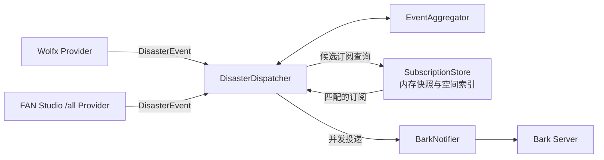

# 灾害预警 Bark 订阅系统

基于 Rust 长驻后端的多渠道灾害实时推送服务。后端同时监听 Wolfx 地震预警和 FAN Studio `/all` WebSocket，将不同来源统一分类、跨渠道去重，再按订阅者地点和灾种规则通过 Bark 推送。

示例：<http://alert.noctiro.moe>

## 数据流

1. Wolfx 和 FAN Studio 分别通过一个 WebSocket 连接向后端推送数据
2. FAN Studio `/all` 消息按 `source` 自动分类为地震预警、地震信息、气象预警、海啸或台风
3. 两个渠道的地震报告进入共享聚合器，避免同一事件重复通知
4. 订阅快照在内存中完成地点、灾种、来源和阈值匹配，再通过 Bark 连接池并发推送

## 后端架构



- `providers/` 是供应商边界。每个适配器只负责 WebSocket 生命周期、供应商协议解析和 `DisasterEvent` 标准化，不访问数据库或 Bark
- `models/` 只包含共享灾害事件和当前订阅格式，不包含 Wolfx 或 FAN Studio 协议结构
- `source_registry.rs` 是来源 ID、渠道、灾种和前端来源选项的唯一注册表
- `DisasterDispatcher` 统一执行有界队列、跨渠道聚合、候选订阅索引查询、精确匹配、并发通知和有限重试
- 队列满时对来源施加背压，并按事件版本合并更新，不丢弃已有预警；`/api/status` 可观察连接和背压计数
- `EventAggregator` 只处理跨渠道事件关联与投递版本，不包含供应商协议判断

## 技术栈

- **服务端**：Rust、Axum、sled、tokio-tungstenite、reqwest（rustls）
- **Web 界面**：单文件 `web/index.html`，原生 JS、Leaflet + CartoCDN 地图
- **发布形式**：Web 界面编译进 Rust 二进制，整个应用只需运行一个进程

## 项目结构

```text
src/                   Rust 应用源代码
web/index.html         Web 界面，通过 include_str! 编译进二进制
Cargo.toml             Rust crate 和构建配置
.env.example           环境变量示例
```

## 部署

灾害监听、订阅 API、Bark 推送和 Web 界面由同一个 Rust 进程提供：

```bash
cp .env.example .env
set -a; . ./.env; set +a
cargo build --release
./target/release/disaster-alert
```

默认监听 `0.0.0.0:30010`，浏览器访问 `http://your-server:30010` 即可使用。生产环境建议将 `SERVER_HOST` 设为 `127.0.0.1`，再由运行环境已有的反向代理提供 HTTPS；进程守护、域名和证书配置也由实际运行环境管理。

## 配置

应用通过环境变量配置。在仓库根目录创建 `.env`，运行前导入或通过进程管理器设置：

```bash
cp .env.example .env
# 编辑 .env
set -a; . ./.env; set +a
```

配置值会在启动时校验；数值格式错误、重连下限大于上限、非正波速、无效并发上限等会直接导致服务启动失败。

`BARK_URL_ALLOWLIST` 支持 HTTP/HTTPS、域名或 IP、显式端口和反向代理子路径，例如 `https://api.day.app`、`http://192.168.1.10:8080`、`https://example.com/bark`。不允许凭据、查询参数或 fragment；末尾 `/` 会被移除，推送时统一追加 `/push`。配置顺序会原样提供给网页端；网页端首次使用时选择第一项。服务端不会把第一项当作发送失败或历史地址失效时的回退目标。

| 变量 | 默认值 | 说明 |
| --- | --- | --- |
| `SERVER_HOST` | `0.0.0.0` | 监听地址 |
| `SERVER_PORT` | `30010` | 服务端口 |
| `ALLOWED_ORIGINS` | (空) | 允许跨域访问 API 的前端 Origin，多个值用逗号分隔；空表示不额外开放跨域 |
| `DB_PATH` | `./data/disaster-alert.db` | 灾害订阅数据库路径 |
| `BARK_URL_ALLOWLIST` | `https://api.day.app` | 前端可选的 Bark 基础 URL 有序白名单，支持 HTTP/HTTPS、端口、IP 和反代子路径；多个值用逗号分隔 |
| `BARK_SOUND` | (空) | Bark 铃声名称，空表示使用默认 |
| `BARK_VOLUME` | `10` | Bark 推送音量 (0-10) |
| `BARK_GROUP` | `灾害预警` | Bark 推送分组名 |
| `BARK_CALL` | `true` | 是否触发 Bark 通话级别推送；默认重复播放通知铃声 |
| `WOLFX_WEBSOCKET_URL` | `wss://ws-api.wolfx.jp/all_eew` | Wolfx 聚合地震预警 WebSocket 地址 |
| `FANSTUDIO_WEBSOCKET_URL` | `wss://ws.fanstudio.tech/all` | FAN Studio 单一聚合 WebSocket 地址，必须使用 `/all` 端点 |
| `RECONNECT_MIN_SECONDS` | `1` | 重连最小间隔秒数 |
| `RECONNECT_MAX_SECONDS` | `30` | 指数退避重连最大间隔秒数 |
| `PUSH_UPDATES` | `false` | 是否推送同一事件的后续报告 |
| `UPDATE_MIN_REPORT_GAP` | `1` | 同事件两次推送之间至少间隔的报告数 |
| `IGNORE_TRAINING` | `true` | 是否跳过演练事件 |
| `IGNORE_CANCEL` | `false` | 是否跳过取消/解除事件；通常应保留解除通知 |
| `P_WAVE_KM_S` | `6.0` | P 波传播速度 (km/s) |
| `S_WAVE_KM_S` | `3.5` | S 波传播速度 (km/s) |
| `STALE_ORIGIN_SECONDS` | `600` | 发震时间超过该秒数视为过期 |
| `DEDUP_KEEP_MINUTES` | `120` | 事件去重窗口分钟数 |
| `MAX_CONCURRENT_NOTIFICATIONS` | `200` | 并发推送上限；实际值不会超过 `HTTP_POOL_SIZE` |
| `HTTP_POOL_SIZE` | `200` | HTTP 连接池大小 |
| `REVERSE_GEOCODING_ENABLED` | `true` | 选点或定位后是否自动解析省、市、区；关闭后仍可手动填写 |
| `REVERSE_GEOCODING_URL` | `https://nominatim.openstreetmap.org/reverse` | Nominatim 兼容的反向地理编码端点；生产环境可改为自建服务 |

## API

所有接口返回统一 JSON：

```json
{
  "success": true,
  "message": "订阅成功",
  "data": {}
}
```

网页通过 `GET /api/reverse-geocode?latitude=...&longitude=...` 自动补全监测地点的行政区域。后端代理并缓存结果，不会把第三方地址直接暴露给浏览器；外部服务不可用时仍可手动填写并保存订阅。

失败时 `success` 为 `false`，`data` 字段省略，`message` 返回可展示的错误原因

| 方法 | 路径 | 用途 | 成功响应 |
| --- | --- | --- | --- |
| `POST` | `/api/subscribe` | 发送 Bark 确认提醒成功后创建或覆盖订阅 | `200` |
| `GET` | `/api/bark-urls` | 返回网页端可选择的 Bark URL 白名单 | `200` |
| `GET` | `/api/subscription-options` | 返回灾害类别、来源目录和默认阈值 | `200` |
| `DELETE` | `/api/unsubscribe` | 按 Bark ID 删除订阅 | `200` |
| `GET` | `/api/stats` | 返回订阅总数 | `200` |
| `GET` | `/api/status` | 返回两个渠道的连接、消息、解析错误、重连和队列背压指标 | `200` |
| `GET` | `/health` | 健康检查 | `200` |

### `POST /api/subscribe`

请求体：

```json
{
  "bark_id": "key",
  "bark_url": "https://api.day.app",
  "locations": [
    {
      "name": "东京",
      "latitude": 35.6,
      "longitude": 139.6,
      "province": "东京都",
      "city": "东京",
      "district": ""
    }
  ],
  "notify_bands": [
    { "min": 1, "max": 1, "level": "passive", "label": "低烈度" },
    { "min": 2, "max": 2, "level": "active", "label": "中等烈度" },
    { "min": 3, "max": 99, "level": "critical", "label": "高烈度" }
  ],
  "disaster_rules": {
    "earthquake_warning": true,
    "earthquake_report": true,
    "weather_warning": true,
    "tsunami": true,
    "typhoon": true,
    "min_earthquake_magnitude": 4.5,
    "weather_radius_km": 100,
    "min_weather_level": 2,
    "min_tsunami_level": 2,
    "typhoon_radius_km": 300
  },
  "source_overrides": {
    "wolfx.jma_eew": true,
    "fanstudio.jma": true,
    "fanstudio.weatheralarm": false
  }
}
```

字段说明：

| 字段 | 当前请求要求 | 说明 |
| --- | --- | --- |
| `bark_id` | 是 | Bark Key，只允许字母和数字，最长 64 字符 |
| `bark_url` | 是 | 必须精确匹配后端 `BARK_URL_ALLOWLIST` 中规范化后的 URL |
| `locations` | 是 | 监测地点列表，至少 1 个、最多 3 个，有效坐标范围为纬度 `-90..90`、经度 `-180..180` |
| `locations[].name` | 否 | 地点名称，最多 80 个字符 |
| `locations[].province` / `city` / `district` | 否 | 行政区字段，用于天气和海啸行政区匹配 |
| `notify_bands` | 是 | 通知规则列表，最多 3 条，烈度范围不能重叠 |
| `notify_bands[].min` / `max` | 是 | 匹配的预估 JMA 烈度范围，取值 `0..99` |
| `notify_bands[].level` | 是 | Bark 中断级别，只允许 `passive`、`active`、`critical` |
| `notify_bands[].label` | 否 | 前端展示标签，最多 32 个字符 |
| `disaster_rules` | 否 | 灾种开关和阈值；省略时使用全部灾种开启的默认配置 |
| `source_overrides` | 否 | 按来源覆盖开关；未出现的来源默认开启，键必须来自 `/api/subscription-options` |

说明：

- `locations` 是地点配置，至少包含一个有效地点
- `critical` 规则的 `max` 小于 `7` 时，后端会扩展为 `99`
- 新订阅默认启用 Wolfx 和 FAN Studio `/all` 中的全部受支持类别与来源
- 同一地震在两个渠道间按时间、距离和震级关联，但来源过滤在订阅匹配阶段完成；禁用 Wolfx 不会阻止已启用的 FAN Studio 来源通知

成功响应：

```json
{
  "success": true,
  "message": "订阅成功",
  "data": { "saved": true }
}
```

常见失败：

| 状态码 | 原因 |
| --- | --- |
| `400` | Bark ID 为空、过长或包含非字母数字字符 |
| `400` | Bark URL 无效或不在白名单中 |
| `400` | 没有有效监测地点 |
| `400` | 通知规则为空、超过 3 条、级别非法或烈度范围重叠 |
| `502` | Bark 确认提醒发送失败，订阅未保存 |
| `500` | 数据库存储失败 |

### `DELETE /api/unsubscribe`

请求体：

```json
{ "bark_id": "key" }
```

成功响应：

```json
{
  "success": true,
  "message": "已取消订阅"
}
```

常见失败：

| 状态码 | 原因 |
| --- | --- |
| `400` | Bark ID 为空、过长或包含非字母数字字符 |
| `404` | 删除失败，通常表示没有对应订阅或数据库删除失败 |

### `GET /api/stats`

返回订阅总数，不返回 Bark ID、位置、通知规则或订阅时间：

```json
{
  "success": true,
  "message": "统计成功",
  "data": { "total_subscriptions": 12 }
}
```

### `GET /health`

健康检查只表示 HTTP 服务可响应：

```json
{
  "success": true,
  "message": "OK"
}
```

### 隐私边界

系统不提供「输入 Bark Key 查询订阅内容」的接口，Bark Key 不能反查用户位置、通知级别或订阅时间，详见 [CONTRIBUTING.md](CONTRIBUTING.md) 中的隐私确认

## 致谢

- 数据源：[wolfx.jp](https://ws-api.wolfx.jp)
- 数据源：[FAN Studio](https://api.fanstudio.tech/doc/ws-api/#home)
- 推送服务：[Bark](https://github.com/Finb/Bark)
